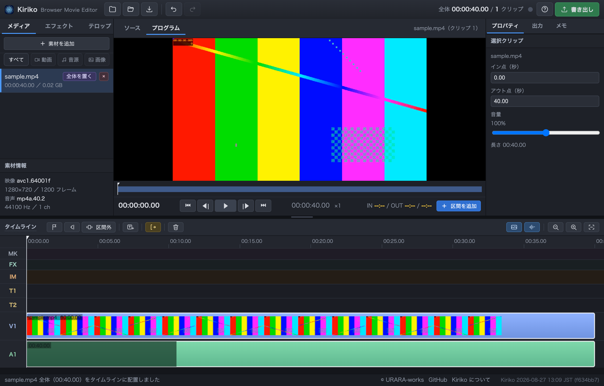

# Kiriko

**ブラウザだけで完結する動画編集ツール。**
インストールもアップロードも要りません。

<https://uraraworks.github.io/Kiriko/>

- [紹介ページ](https://uraraworks.github.io/Kiriko/about.html)
- [使い方](https://uraraworks.github.io/Kiriko/help.html)

名前は江戸切子から。「切」の字がそのままカット編集を表していて、
細かく切り込みを入れて形にしていく感じが編集作業に重なる。



<!-- 共有時に出る画像は public/social.png（npm run social で作り直せる） -->

## できること

カット／テロップ（背景画像・アイコン・複数行のセット）／画像（一部だけ切り出して配置）／
効果音・BGM／全画面と部分のぼかし／マーカー／アンドゥ／mp4 書き出し。

- **動画はどこにも送らない。** 読み込みも書き出しも、すべてブラウザの中で完結する
- **長い素材でも動く。** 1.5 時間・14GB でもまるごとメモリに載せない
- **書き出しが速い。** 15 分の動画でおよそ 2〜3 分（WebCodecs によるハードウェア処理）。
  実測は [docs/DESIGN.md の検証結果](docs/DESIGN.md#検証結果2026-08-27--m2-macchromium系)
- **生成 AI から操作できる**（MCP 対応）。セリフの書き起こしや無音の検出を任せられる
- **切りすぎても戻せる。** カットで消した分は捨てずに残してあり、
  継ぎ目にカーソルを合わせて秒単位で返せる（<kbd>[</kbd> <kbd>]</kbd>）

Chrome / Edge 向け。Safari と Firefox は書き出しに必要な WebCodecs が未対応。

## 動かす

素の静的ファイルなので、ビルドは要らない。

```bash
python3 -m http.server 8901
```

`http://localhost:8901/` を **Chrome / Edge** で開く（`file://` だと WebCodecs 系 API が見えない）。
公開版をそのまま使うなら <https://uraraworks.github.io/Kiriko/>。

フッターの版表示だけは git から作るので、必要なら:

```bash
node scripts/gen-version.mjs
```

## 使い方

1. 案内画面から **作業フォルダを開く**（編集する動画が入っているフォルダ）
2. **素材を追加**（または mp4 をドロップ）で素材を読み込む
3. カットする（下の 2 方式のどちらでも）
4. <kbd>T</kbd> でテロップを追加し、プレビュー上でドラッグして位置決め
5. <kbd>B</kbd> でぼかし区間、音源を読み込んでビンの ＋ から配置
6. **書き出し** で mp4 保存

フォルダを開くまでは編集操作をすべて止めている（保存先も素材の在り処も決まらないため）。
`showDirectoryPicker` の無いブラウザではこの制限は掛からない。

### 「読み込む」と「タイムラインに置く」は別

紛らわしいので整理しておく。

| 操作 | 場所 | 何が起きるか |
|---|---|---|
| **素材を追加** | 左パネル「メディア」 | ファイルを読み込んで**ビンに入れるだけ**。タイムラインは変わらない |
| **全体を置く** | ビンの動画素材の行 | その素材を**まるごと**タイムラインに置く。ここから要らない範囲を切り取っていく（方式 A） |
| **区間を追加** | ソースモニター下 | ソースの IN〜OUT だけを**タイムラインの末尾に足す**（方式 B） |

ビンに入れた素材は、タイムラインに置くまで完成尺に影響しない。
1 本の素材から何度でも区間を拾えるし、逆に置かないまま残しておいてもよい。

### カットの 2 方式

**A. 範囲を消していく（Kdenlive と同じ流れ・キーボードだけで完結）**

ビンの「全体」ボタンで素材をまるごとタイムラインに置き、いらない所を消していく。

1. カーソルを頭に置いて <kbd>I</kbd>（範囲の開始）
2. <kbd>←</kbd> <kbd>→</kbd> で 1 フレームずつ、<kbd>Space</kbd> や <kbd>L</kbd> で送りながら終わりまで移動
3. <kbd>O</kbd>（範囲の終了）→ <kbd>Delete</kbd> で切り取り、後ろが詰まる

切り取るとカーソルは切った位置に残り、範囲選択も解除されるので、そのまま次のカットに入れる。
テロップ・ぼかし・BGM も切った分だけ前に詰まる（範囲内に収まっていたものは消える）。
同じ操作はタイムライン左上の **［開始］［終了］［切り取り］［解除］** ボタンでもできる（ツールチップにキーが出る）。

**B. 使う所を拾う（加算方式）**

ソースモニターで <kbd>I</kbd> / <kbd>O</kbd> を打って <kbd>Enter</kbd> でクリップとして追加。
アウト点が次のイン点に自動で乗るので連打で拾える。長尺から短いカットを大量に集めるとき向き。

<kbd>I</kbd> / <kbd>O</kbd> はアクティブなモニターに効く（ソース＝拾う区間、プログラム＝切り取る範囲）。

### ショートカット

| キー | 動作 |
|---|---|
| <kbd>Space</kbd> | 再生／停止 |
| <kbd>I</kbd> / <kbd>O</kbd> | 範囲の開始／終了（アクティブなモニターに効く） |
| <kbd>Delete</kbd> | 範囲を切り取って詰める（範囲が無ければ選択中の要素を削除） |
| <kbd>Esc</kbd> | 範囲選択を解除 |
| <kbd>Shift</kbd>+<kbd>I</kbd> / <kbd>O</kbd> | 範囲の開始／終了へカーソルを飛ばす |
| <kbd>Enter</kbd> | クリップ追加（ソースモニター。アウト点が次のイン点になる） |
| <kbd>J</kbd> <kbd>K</kbd> <kbd>L</kbd> | 逆送り／停止／早送り |
| <kbd>←</kbd> <kbd>→</kbd> | 1 フレーム（<kbd>Shift</kbd> で 1 秒） |
| <kbd>T</kbd> / <kbd>B</kbd> | テロップ追加／ぼかし区間追加 |
| <kbd>M</kbd> | 再生位置にマーカーを立てる |
| <kbd>,</kbd> / <kbd>.</kbd> | 前／次のマーカーへ |
| <kbd>G</kbd> / <kbd>F</kbd> | 次／前の「区間マーカーの外」を範囲選択 |
| <kbd>⌘</kbd>/<kbd>Ctrl</kbd>+<kbd>Z</kbd> | 元に戻す |
| <kbd>⇧⌘Z</kbd> / <kbd>Ctrl</kbd>+<kbd>Y</kbd> | やり直す |
| <kbd>Ctrl</kbd>+<kbd>S</kbd> | プロジェクト保存 |
| <kbd>?</kbd> | ショートカット一覧 |

タイムラインのホイール操作：

| 操作 | 動き |
|---|---|
| 横スワイプ（マジックマウス／トラックパッド） | 時間軸を左右に |
| ホイール（上下） | トラックを上下に。収まっている時は時間軸を左右に |
| <kbd>Shift</kbd>＋ホイール | 時間軸を左右に（Windows の慣習） |
| <kbd>⌘</kbd> / <kbd>Ctrl</kbd>＋ホイール | 拡大縮小（カーソル位置を固定） |

Mac のトラックパッドはピンチがそのまま拡大縮小になる。
拡大すると下に横スクロールバー、トラックが入りきらないと縦スクロールバーが出る。
タイムラインの高さは上端のスプリットバーで変えられる。

右クリックは文字入力欄以外ではブラウザ標準のメニューを出さず、
プレビューとタイムラインでは削除などの項目を出す。

`.kdenlive` は「開く」からでもドロップでも取り込める（既存プロジェクトのカット列を引き継ぐ）。
該当する mp4 を読み込むと自動でクリップに反映される。詳しくは [docs/DESIGN.md](docs/DESIGN.md)。

## 生成 AI から操作する

MCP（Model Context Protocol）に対応しているので、対応した生成 AI のツールと繋いで、
セリフの書き起こしや無音の検出を任せられる。動画そのものはブラウザから出ない。

**お使いの生成 AI に [mcp/README.md](mcp/README.md) を示して**
「ここに書いてある通りに Kiriko へ MCP 接続できるようにして」と指示すれば、そのまま設定できる。

## テスト

```bash
npm test          # 単体＋静的検査（数秒。依存なし）
npm run test:e2e  # 実 Chrome での結合テスト（1 分ほど。ffmpeg が要る）
```

## 共有した時に出る画像

`public/social.jpg`（1280×640、約 100KB）。作り直すには:

```bash
npm run social
```

各ページの `og:image` / `twitter:image` はこれを指しているので、
**Pages の URL を貼れば**この画像が出る。
同じ絵の PNG（`public/social.png`）も出るので、GitHub の Social preview に上げたい時はそちらを使う。

> 共有カードは軽い方が取り込まれやすいので、OGP には jpeg を使っている。
> X は一度読んだページを覚えているので、貼り直しても古いカードが出ることがある。
> その時は URL に `?v=2` のような目印を付けると読み直してくれる。

`github.com/uraraworks/Kiriko` の方を貼った時は、GitHub が自動生成した画像
（リポジトリ名・説明・アバター）になる。他のリポジトリ（FMSound / Sprout68k）も同じ扱いで、
そちらは設定していない。変えたい場合だけ Settings → General → Social preview から手で上げる
（この項目は REST API に無い）。

`npm run hooks:install` を一度実行すると、**push の前に `npm test` が走る**ようになる
（急ぐときは `git push --no-verify`）。結合テストは GitHub Actions でも回している。

詳しくは [docs/DESIGN.md](docs/DESIGN.md#テスト)。

## ドキュメント

| | 中身 |
|---|---|
| [使い方](https://uraraworks.github.io/Kiriko/help.html) | はじめて触る人向け。画面写真つき |
| [紹介ページ](https://uraraworks.github.io/Kiriko/about.html) | どういうものか・作った理由 |
| [mcp/README.md](mcp/README.md) | 生成 AI から操作するための手順書とツール一覧 |
| [docs/AUTOMATION.md](docs/AUTOMATION.md) | ページ内 JS（`window.bme`）から操作する API |
| [docs/DESIGN.md](docs/DESIGN.md) | 実装メモ。設計判断・データ構造・踏んだ落とし穴 |

## ライセンス

MIT（[LICENSE](LICENSE)）。同梱ライブラリは [THIRD-PARTY.md](THIRD-PARTY.md) を参照。

© URARA-works — https://www.urara-works.jp/
